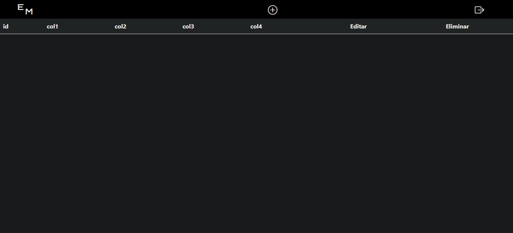
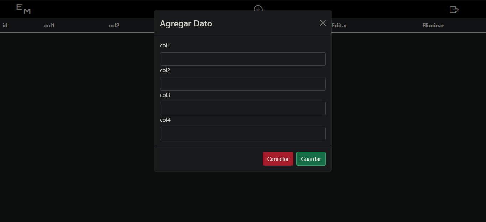
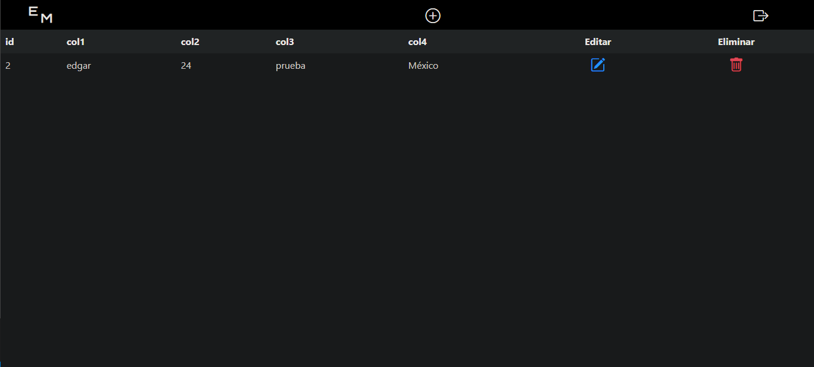
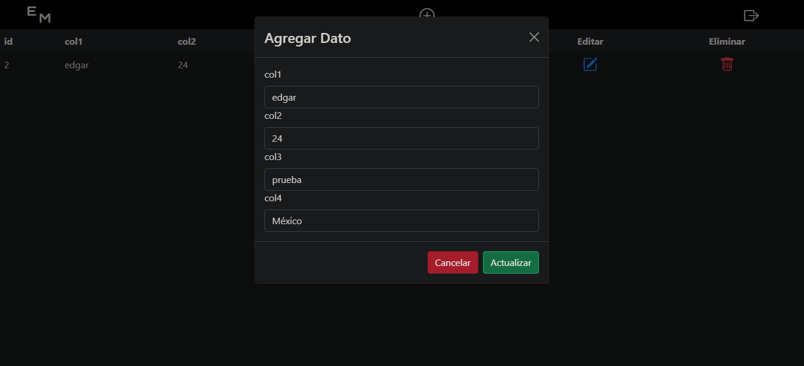
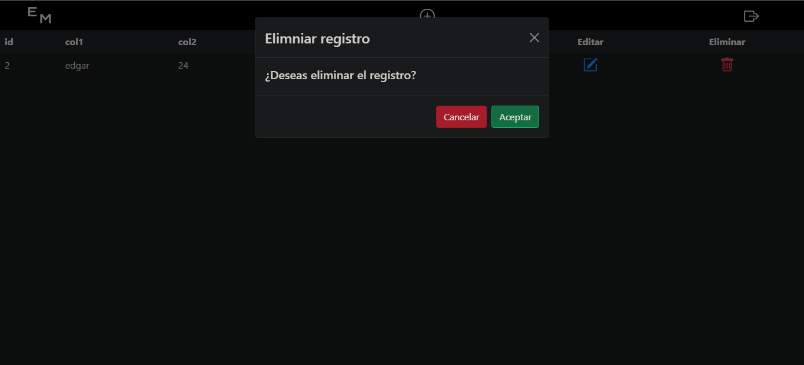

# Tabla de registros CRUD
## MySQL y PHP

tabla que permite realizar operaciones CRUD(Create, Read, Update & Delete) con MySQL y PHP

## Configuración
cambia el nombre del archivo .env.example por .env y detro del mismo colocatus parametros de conexión a tu base de datos MySQL

~~~
    DB_SERVER = "servidor"
    DB_NAME = "nombre_de_la_DB"
    DB_USER = "usuario"
    DB_PASSWORD = "contraseña"
~~~

### Inicio Login
clave puede ser modificada en archivo `auth.php`
"codigo_acceso"

### Tabla de inicio

### Agregar registro
para agregar un registro solo da click en el icono de +

### Actualizar registro
solo pulsar en el icono azul y se abrira un formulario con los datos del registro

### Eliminar un registro
para eliminar u registro solo da click en en icono rojo

